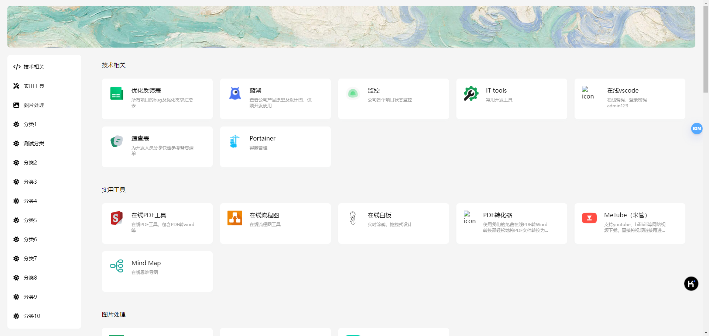
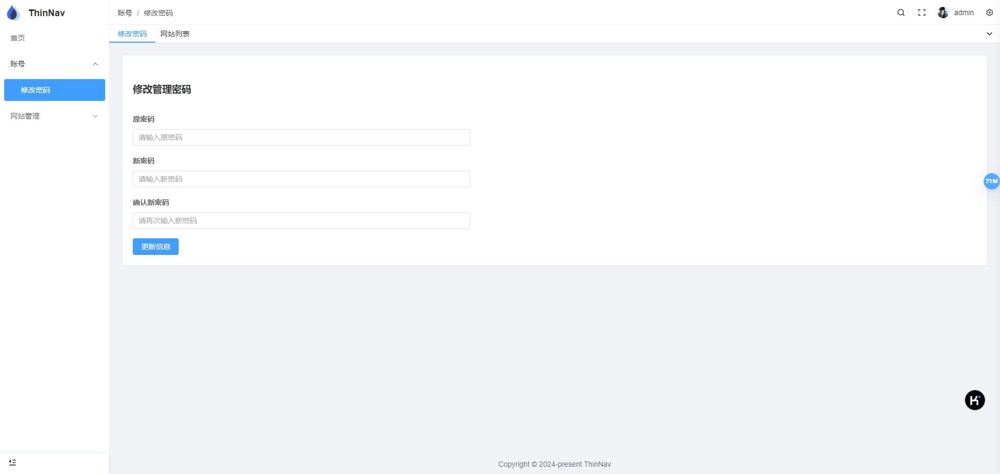
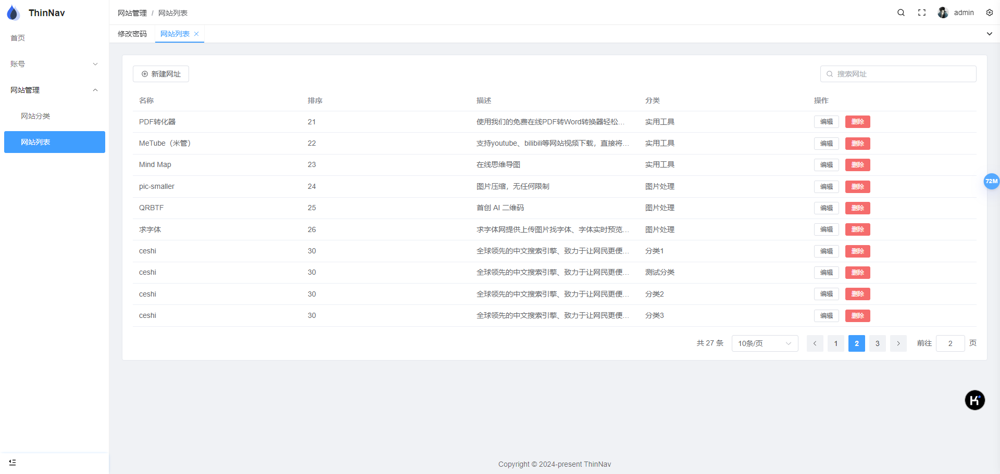

# 以极简为目的的网址导航
因为自己工作及生活中需要用到一些网址导航的页面，但找到的一些网址导航项目要么过于复杂，要么有些基础功能都没有实现（比如没有后台管理），对于非程序员非常不友好。  

在ChatGPT等AI技术发展火热的今天，我想虽然自己不太会写代码，但或许也能借助AI的力量实现一个简单的项目，所以开发了这样一个自己用的上，且能检验一下自己使用ChatGPT能力的网址导航项目。

## 使用说明
### 使用docker compose方式部署
首先git clone本项目，进入项目目录，执行以下命令：
```bash
docker compose up -d
```
等待部署完成，访问http://127.0.0.1:8888

### 后台管理
后台地址默认添加后缀/admin即可：http://127.0.0.1:8888/admin  
部署后，会自动创建一个管理员账号，账号名为admin，密码为123456   
密码可在登录后修改。  
后续愉快的创建分类及网址就完事了。

### 技术栈说明
用户端：Vue.js  
后台管理：pureAdmin  
后端：fastapi  
数据库：sqlite

### 项目截图
#### 用户端


#### 后台管理
  



## 致谢
- [ChatGPT](https://chatgpt.com)
- [pureAdmin](https://github.com/pure-admin/vue-pure-admin)
- [设计图](https://js.design/community?category=detail&type=resource&id=6231c96a70f79b38da026d4e)
- [那么，我是如何使用 ChatGPT 的](https://kenengba.com/post/3800.html)
- 感谢一个可以随时腾讯会议帮我看代码的朋友


